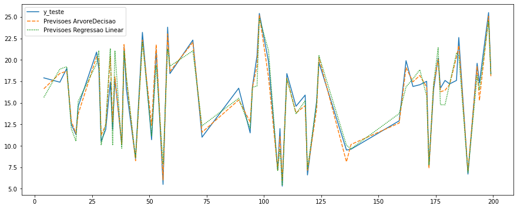

# Previsao-de-vendas
Previsao de vendas com os modelos de machine learn de regressao linear e arvore de decisao

- Desafio é conseguir prever as vendas que vamos ter em determinado período com base nos gastos em anúncios nas 3 grandes redes que a empresa Hashtag investe: TV, Jornal e Rádio
- TV, Jornal e Rádio estão em milhares de reais
- Vendas estão em milhões

- Dataset: https://drive.google.com/drive/folders/1o2lpxoi9heyQV1hIlsHXWSfDkBPtze-V?usp=sharing

### Passo a Passo ✔

- Passo 1: Entendimento do Desafio
- Passo 2: Entendimento da Área/Empresa
- Passo 3: Extração/Obtenção de Dados
- Passo 4: Ajuste de Dados
- Passo 5: Análise Exploratória
- Passo 6: Modelagem + Algoritmos
- Passo 7: Interpretação de Resultados

#### Modelos que foram usados 

-  Arvore de decisão 
-  Regressao LinearSVC

